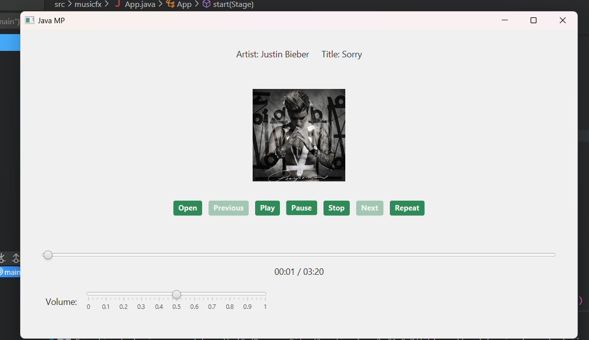

Simple Music Player

A lightweight desktop-based Java application that allows users to play, pause, resume, and loop `.mp3` audio files using a simple graphical interface.

Features

- **Audio Format Support** – Play `.mp3` files
- **Drag-and-Drop + File Chooser** – Easily load songs via file dialog or drag from your system
- **Playback Controls** – Play, Pause, Stop, Next, Previous, Repeat
- **Repeat Mode** – Loop the current song
- **Metadata Display** – Shows embedded song info (Title, Artist)
- **Album Art** – Displays image if embedded in the file
- **Progress Tracking** – Real-time slider with current and total duration
- **Volume Slider** – Adjustable volume with tick marks

UI Preview



Requirements

- Java 17+ installed and configured
- JavaFX SDK 21.0.7 downloaded from [gluonhq.com](https://gluonhq.com/products/javafx/)
- VS Code with Java Extension Pack

Run with VS Code

1. Clone the repository  
   ```bash
   git clone https://github.com/LeN3003/music-player.git
   cd music-player
2. Make sure the JavaFX SDK path is correctly set in:
   .vscode/launch.json
   .vscode/tasks.json
3. Build and Run:
   Press Ctrl + Shift + B to build
   Press Ctrl+Shift+P -> Tasks:Run Task ->Run JavaFx
       

